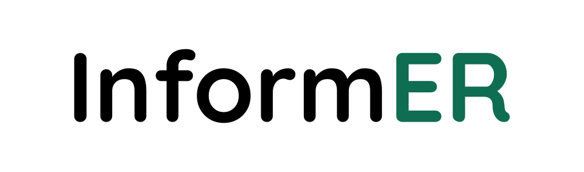

# InformER
Aarin H. Dave[^1], Aarav H. Dave[^1]

## Summary
[VAD VIP Day 2024] [#HouseOfCode 2024] InformER is an app by Clinicircle ... Development is centered around accessibility features, many inspired from patient feedback and recommendations.

## Usage
To test out the app, please use the name "John Smith" or "Jane Doe", institution code "InformERDemo", and a unique session identifier.

## Abstract
*Coming Soon*

## Report
*Coming Soon*

## Recognitions
*Coming Soon*

## Technical Specifications
The framework used for app development is Flutter 3. Apple App Store and Google Play availability pending.

Storage required: 2.5 GB

| Platform | Compatible? |
|----------|-------------|
| iOS      | ✅           |
| Android  | ✅           |
| macOS    | ❌           |
| Windows  | ❌           |
| Linux    | ❌           |
| Web      | ❌           |

## License
This software, as with all subsequent versions of the software, is protected by the CC-BY-NC-ND license. In summary, this does not allow commercial usage, distribution, or distribution of modifications of the software. In additon, you are required to credit authorship and state any changes you may have made.
> For more information, please refer to the `LICENSE` file.

## Contacts
For questions concerning the contents of this repository, please contact aarindave [at] gmail [dot] com.

[^1]: Lowndes High School, Valdosta, GA
